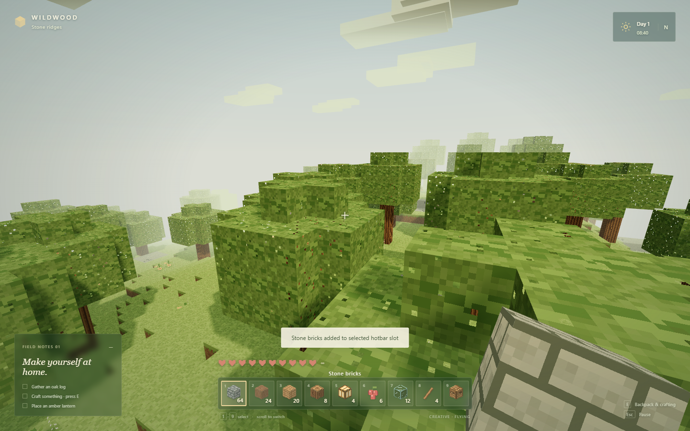

# Wildwood

A single-player voxel sandbox inspired by Minecraft, with an original woodland look. Explore a procedural world, build a home, craft tools, and survive the night. Built with JavaScript, Three.js, Web Workers, Vite, and Electron for Windows.

Personal project by [Mateoutec](https://github.com/Mateoutec), developed with assistance from ChatGPT/Codex for implementation, debugging, and testing.

[Download for Windows](https://github.com/Mateoutec/wildwood/releases/tag/v1.1.0) · [Guía en español](LEEME.txt) · [Desktop guide / Guía de escritorio](LEEME-ESCRITORIO.txt) · [Validation](VALIDATION.md)



## Features

- First-person movement and mouse look, collision, gravity, swimming, and health.
- Chunk-based terrain with trees, caves, rivers, ores, and multiple block types.
- Block mining and placement, a hotbar, inventory, tools, and basic crafting.
- Survival and Creative modes, passive sheep, and hostile night creatures.
- Day/night lighting, pixel textures, pause/settings, autosave, and world import/export.
- A standalone Windows app and a browser version sharing the same game engine.

## Windows desktop application — version 1.1

Download **Wildwood-Portable-1.1.0.exe** from [Releases](https://github.com/Mateoutec/wildwood/releases/tag/v1.1.0) and double-click it. Use a 64-bit Windows PC with WebGL 2 graphics support, a keyboard, and a mouse. The application includes Electron 44.3.0 and runs with its own window, local assets, and GPU acceleration; it does not require a browser, a localhost server, Node.js, or an Internet connection to play. **F11** toggles full screen.

When building from source, `desktop-release/Wildwood-Portable-1.1.0.exe` is the single-file portable package. Alternatively, run `desktop-release/win-unpacked/Wildwood.exe` and keep the files in `win-unpacked` together. The unpacked executable avoids extraction at startup.

Desktop progress lives in `%APPDATA%/Wildwood` and persists across relaunches and executable updates. Browser and desktop saves are separate. Use **Export world** in the browser, then **Import a saved world** in the app to bring your existing world over. See **LEEME-ESCRITORIO.txt** for Spanish instructions.

To build the desktop release from a fresh checkout, install **Node.js 22.12 or newer** and run:

```powershell
git clone https://github.com/Mateoutec/wildwood.git
cd wildwood
npm ci
npm run desktop:build
```

The first installation and packaging require Internet access to download dependencies. Executables, dependencies, generated builds, and personal saves are excluded from the source repository.

Test the packaged executable with `npm run test:desktop:packaged`. The desktop wrapper is in `desktop/`; it serves the bundled game through an internal `wildwood://game` protocol with sandboxed rendering and context isolation. Packaging preserves the same Three.js engine and does not promise a higher frame rate.

## Play in a browser

Install **Node.js 22.12 or newer** and use **Microsoft Edge or Google Chrome** with graphics acceleration enabled. In the project folder, run:

```powershell
npm ci
npm run build
npm start
```

Open **http://localhost:4173**. On Windows, you can also double-click **Play Wildwood.cmd**; it installs dependencies and builds the game when needed, starts the local server, and opens the browser. Keep its console window open while playing; close it or press Ctrl+C to stop the server. After setup, the built game works offline. Do not open `dist/index.html` directly: the game uses a local server for its JavaScript modules and worker.

Click **New adventure**, choose a name, seed, and Survival or Creative, then **Step into Wildwood**. The mouse is captured for first-person look. Press **Esc** at any time to release it and pause.

## Controls

| Input | Action |
| --- | --- |
| W A S D | Move |
| Mouse | Look |
| Space | Jump; swim up in water |
| Shift | Sprint |
| Hold left mouse | Mine blocks |
| Left mouse | Attack a creature |
| Right mouse | Place the selected block; eat selected food; open a targeted workbench |
| Shift + right mouse | Place a block against a workbench |
| 1–9 or mouse wheel | Change the selected hotbar slot |
| E | Backpack and crafting; press again to return |
| Click item, click destination | Move, swap, or merge inventory stacks |
| Shift + click an inventory item | Move it between backpack and hotbar |
| Esc | Pause/settings/save/export; release the mouse |
| F3 | Performance and coordinates display |
| F in Creative | Toggle flight |
| Space / Ctrl or C in flight | Ascend / descend |
| Middle mouse in Creative | Pick the targeted block |

If a browser refuses mouse capture, hold middle mouse to look or use the arrow keys to turn. Normal Edge/Chrome play uses pointer lock.

## Your first little home

You start with a wooden pickaxe, earth, planks, logs, lanterns, berries, glass, sticks, and a workbench. Follow the field notes in the lower left, or set your own direction.

1. Hold left click on an oak trunk to collect a log. Press E and craft planks.
2. Place your workbench nearby. Recipes unlock within about four blocks.
3. Mine exposed stone and coal with the wooden pickaxe. Use cobblestone and sticks to craft a stone pickaxe and a sword.
4. Build a small shelter and place amber lanterns. A three-block-high wall will keep the Hollows outside.
5. Dig down in steps to find iron and moonstone. Stone picks can collect these ores; the workbench can smelt iron with coal, fuse sand into glass, and make faster iron picks.

A full day and night lasts **12 minutes**. Sheep wander the meadows; Hollows spawn after dark, chase nearby survival players, and fade in daylight. Eat berries or trail rations with right click to restore health. Wildflowers and some leaves yield berries. Sheep drop wool and trail rations; Hollows drop coal. Fall damage, collision, gravity, swimming, air supply, and drowning are active in Survival. Respawning keeps your inventory and returns you to the original clearing.

Creative mode provides unlimited building from the backpack palette, flight, instant mining, and protection from damage. Click a palette block to fill your currently selected hotbar slot. Creative placement does not consume blocks.

## Saves and backups

- Progress automatically saves every **30 seconds of play**, when pausing, and when leaving the page. The saved state includes terrain edits, seed, inventory, selected item, position, health, world time, field notes, and creatures.
- Use **Pause → Save world** to save immediately. **Continue journey** restores the local save.
- Use **Pause → Export world** to download a `.wildwood.json` backup. **Import a saved world** on the title screen opens it again.
- There is one active local world per browser address. Starting a new world replaces the local save after loading; export the previous world first to keep both.
- Always use **http://localhost:4173**. Browser storage is separate for `127.0.0.1`, other ports, other profiles, and private windows. Clearing browser data removes local saves; exported files are independent.
- A validated previous save is retained as a recovery backup. Import validation rejects malformed data. If browser storage fills, the previous primary save remains intact and the UI tells you to export your current world.

## Included systems and scope

The world streams deterministic **16 × 64 × 16** chunks across positive and negative coordinates. It contains layered hills, river valleys, sand, coherent cave pockets, cross-border oak trees, wildflowers, coal, iron, and rare moonstone. There are 19 visible block types including glass, workbenches, wool, bricks, and light-emitting lanterns, plus inventory-only materials, food, and tools. Twelve recipes form a complete gathering/building/tool progression.

This is a deliberately focused single-player vertical slice. Water occupies generated or edited voxels and supports swimming, but does not dynamically flow. Crafting uses a recipe list and a nearby workbench; tools do not wear out. There is no multiplayer, hunger meter, redstone, furnace timer, or enemy pathfinding through mazes. The world is 64 blocks tall, supports coordinates up to ±100,000 blocks, and validates saves up to 300,000 edited voxels.

## Performance and settings

Meshes contain exposed faces only. Ambient occlusion is calculated per vertex, neighboring chunk data hides boundary faces, worker threads build geometry, and Three.js culls chunks outside the camera frustum. Chunks beyond the streaming radius are disposed, while edited blocks remain in the save data. One texture atlas batches block rendering; only nearby lanterns receive point lights.

View distance defaults to **64 blocks** and ranges from 32 to 96. If needed, open Settings and reduce view distance, select 65% render resolution, or turn off soft shadows. Sensitivity, field of view, sound volume, auto jump, and performance display are also adjustable. Settings persist locally.

## Develop and verify

```powershell
npm ci
npm run dev
```

Development runs at http://localhost:4173. To rebuild and run the production version:

```powershell
npm run build
npm start
```

Regression checks:

```powershell
npm test
npm test -- tests/desktop-assets.test.cjs
npm run test:browser
```

The core suite tests generation, chunk edits and reloads, spawn safety, inventory transactions, crafting constraints, collision, jump/gravity, ray picking, mesh winding/culling, persistence, backup recovery, and malformed imports. The Playwright suite requires Microsoft Edge and runs the production build in a separate headless profile at port 4174, uses real keyboard/mouse interactions, and writes screenshots, an exported world, a JSON report, and a trace under `test-results/`. Run `npm run build` after source changes before browser tests. The diagnostic game object is exposed only when the URL has `?test=1`.

For the desktop app, run `npm run build` followed by `npm run desktop`, or run `npm run desktop:build` followed by `npm run test:desktop:packaged` to verify the packaged Windows application. Test profiles and reports are generated locally and are not committed. See [VALIDATION.md](VALIDATION.md) for the recorded results and the distinction between the unpacked and portable builds.

The core modules are in `src/`; original textures and item icons are drawn by `textures.js` with deterministic canvas pixels. There are no remote font or image requests. Three.js's MIT license is included in `THIRD-PARTY-LICENSES.txt`.

## Project structure

| Path | Purpose |
| --- | --- |
| `src/` | Terrain, chunks, meshing, rendering, physics, gameplay, UI, and saves |
| `public/` | Static assets |
| `desktop/` | Electron application, isolated preload, asset protocol, and icon generator |
| `tests/` | Game logic, browser interaction, and desktop regression checks |
| `docs/screenshots/` | Selected screenshots captured from the running game |
| `server.mjs` | Local production web server |

## License

No open-source license has been selected for the project's own code; `package.json` currently declares `UNLICENSED`. Third-party components retain their respective licenses. Preserve [THIRD-PARTY-LICENSES.txt](THIRD-PARTY-LICENSES.txt) and the license notices bundled with Electron when distributing the application.
